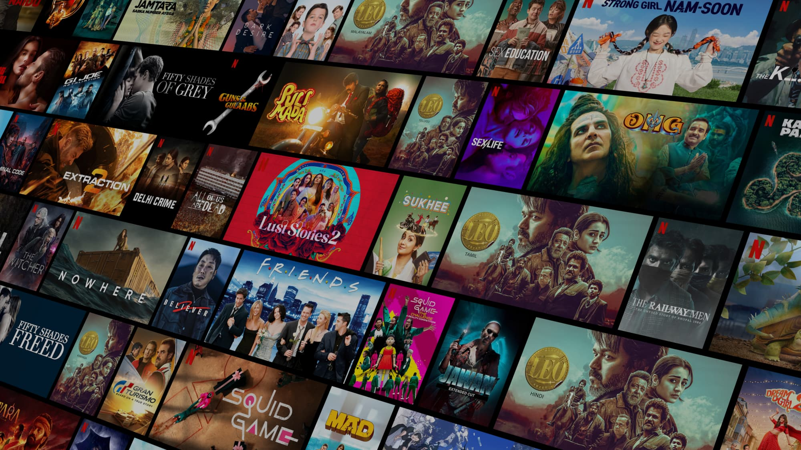
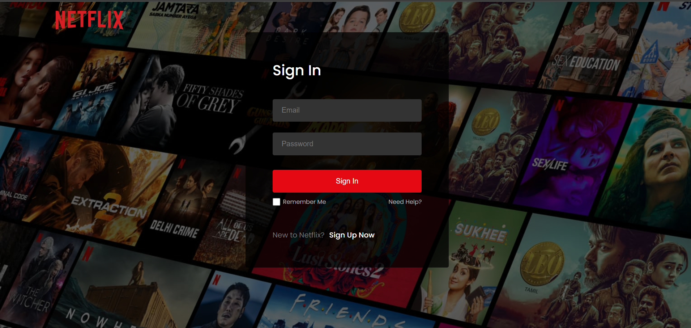
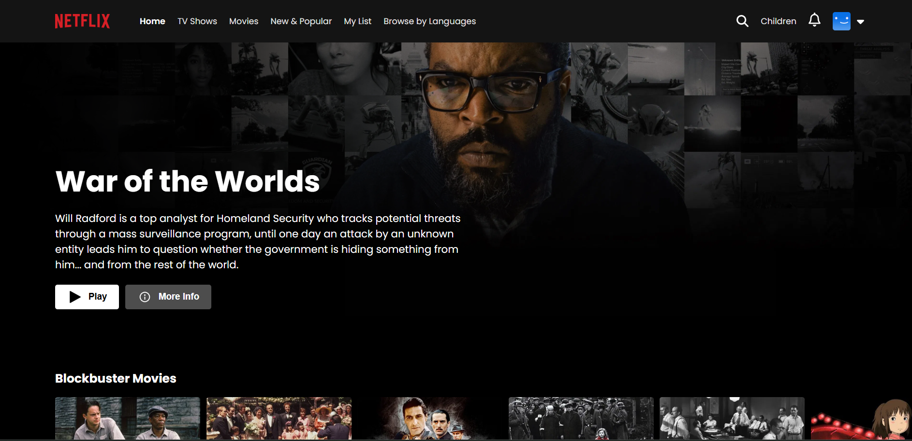

# 
Streamflix

## Overview
Streamflix is a responsive, Netflix-inspired streaming platform that allows users to browse movies, create watchlists, and enjoy a seamless streaming experience. The project leverages modern web technologies for a performant and user-friendly interface.

### Highlights
- Responsive design for desktop and mobile.
- Dynamic movie listings powered by [TMDb API].
- User authentication with Firebase Authentication.
- Personalized watchlists stored in Firebase Firestore.
- Genre filtering, search functionality, and persistent sessions.
- Modern UI with TailwindCSS for a clean, intuitive experience.

## Tech Stack
- **Frontend:** React.js, Tailwind CSS
- **Backend:** Firebase Authentication, Firestore
- **API:** TMDb API
- **Deployment:** Vercel
- **Version Control:** Git, GitHub

## Screenshots

## Links
- **Live Demo:** [Streamflix Live](https://streamflix-gold-delta.vercel.app/)
- **GitHub Repository:** [Streamflix GitHub](https://github.com/sarthakbisht80/streamflix.git)
